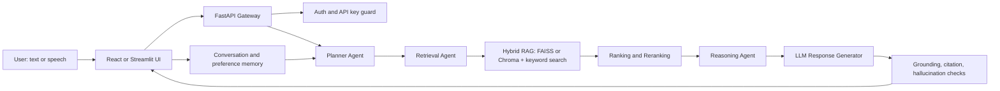

# BharatLLM Architecture Roadmap

BharatLLM is now structured as a scholarship assistant with an agentic RAG core. The current app is Streamlit-first, while the production target can split the same domain modules into FastAPI services and a React/Tailwind frontend.

## Target System

## Core Modules

- `scholarship_schema.py`: normalizes old and production scholarship fields.
- `eligibility_checker.py`: strict rule engine for mandatory eligibility criteria.
- `scoring_engine.py`: weighted match scoring with hard penalties for education/deadline failures.
- `recommendation_engine.py`: combines eligibility, scoring, explanations, and recommendation tags.
- `vector_search.py`: adapter for FAISS/semantic search.
- `agents/planner_agent.py`: detects user intent and chooses a retrieval strategy.
- `agents/retrieval_agent.py`: runs search over the vector index.
- `rag/retrieve.py`: hybrid semantic and lexical scoring with intent boosts.
- `agents/ranking_agent.py`: combines eligibility, metadata, and retrieval quality.
- `agents/reasoning_agent.py`: builds the grounded evidence brief used by the LLM.
- `agents/summarizer_agent.py`: creates fallback answers and memory summaries.
- `agents/memory_agent.py`: stores language, state, and recent turn preferences in session state.
- `evaluation/evaluate_rag.py`: starter metrics for ROUGE-like coverage, citation coverage, and hallucination risk.

## Recommended AI Stack

- LLM orchestration: LangChain or LlamaIndex for production pipelines; current repo uses explicit lightweight agents.
- Vector database: FAISS for local speed, ChromaDB for persistent developer workflows, Milvus or Weaviate for large deployments.
- Embeddings: `BAAI/bge-m3`, `intfloat/multilingual-e5-base`, or Indic-tuned sentence transformers when available.
- Reranking: `BAAI/bge-reranker-base`, Cohere rerank, or a local cross-encoder.
- Indian language NLP: AI4Bharat IndicTrans2, IndicNLP, IndicLLMSuite, and curated government/domain datasets.
- Speech: Whisper or faster-whisper for STT, AI4Bharat/Indic speech resources where available, and TTS through Indic-compatible models.
- Fine-tuning: HuggingFace Transformers, PEFT/LoRA, PyTorch, and evaluation sets split by language/domain.

## Indian Optimization

Support these tracks explicitly:

- Hinglish and code-mixed normalization before retrieval.
- Query expansion with translated terms across English and the selected Indian language.
- Domain packs for scholarships, legal aid, agriculture, education, and government schemes.
- Language-specific evaluation sets for Hindi, Tamil, Bengali, Marathi, Telugu, Gujarati, Kannada, Malayalam, Punjabi, Odia, and Urdu.
- Data sources from AI4Bharat, IndicTrans2, IndicLLMSuite, BharatGen, public scholarship portals, government PDFs, and curated state scheme datasets.

## Deployment Strategy

Start with the current Streamlit app for demos. For production:

- Move request handling to FastAPI with async endpoints.
- Use Redis for user sessions, cache, and rate limits.
- Store documents in object storage and metadata in Postgres.
- Run FAISS/Chroma as a retrieval service, then graduate to Milvus/Weaviate for scale.
- Serve GPU LLM workloads with vLLM or TGI.
- Add Prometheus/Grafana metrics for latency, cache hits, retrieval precision, and failed translations.
- Containerize with Docker and deploy on Kubernetes with separate CPU and GPU node pools.

## Evaluation Plan

Track:

- Retrieval recall@k and MRR by language.
- Citation coverage for every answer.
- Hallucination risk from unsupported claims.
- BLEU/ROUGE for generated summaries where reference answers exist.
- Human preference ratings for helpfulness, safety, and cultural fit.
- Latency percentiles for translation, retrieval, reranking, and generation.
